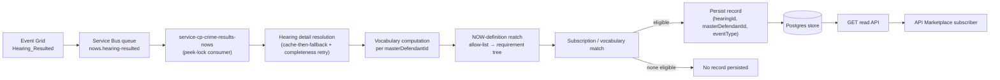
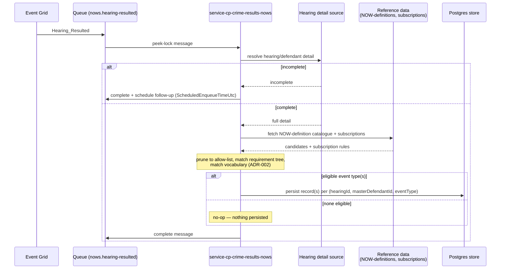
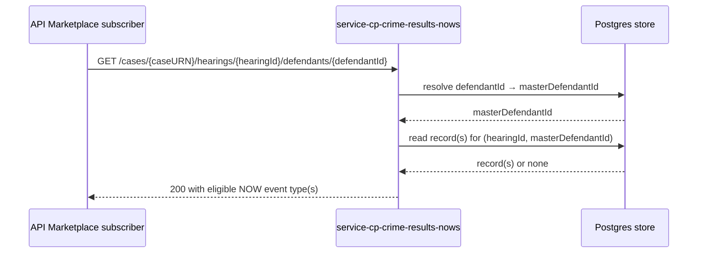

# NOWs API Marketplace Service — Design

Implements [`ADR-003`](../pipeline/adrs/003-nows-api-marketplace-service-design.md) (AMP-907).
Incorporates [`ADR-001`](../pipeline/adrs/001-hearing-resulted-queue-ingestion-for-nows-read-api.md)
(ingestion/store shape) and [`ADR-002`](../pipeline/adrs/002-now-generation-gate-scope-and-record-keying.md)
(generation-gate matching) as already-decided detail — not restated here beyond what a diagram
needs.

## 1. Component architecture

## 2. Ingestion sequence

## 3. Read sequence

The subscriber addresses a resource by `caseURN`/`defendantId` — the identifiers they already
hold — never by `masterDefendantId`, which is this service's own internal merge key (ADR-002).
Resolving one to the other is this service's job, not the caller's. Endpoint path above is
illustrative — the OpenAPI contract in `api-cp-crime-results-nows` is not yet authored.

## 4. Open items

- Empty-result response shape (200 with empty array vs. 404) — not yet decided.
- Retry durations/max-tries for this service's own failure mode (ADR-001) — not yet sized.
- Store schema for the `(hearingId, masterDefendantId, eventType)` key — not yet migrated.
- `defendantId → masterDefendantId` resolution mechanism — likely a mapping persisted at
  ingestion time (the merge is already computed there), but not yet decided as its own schema.
