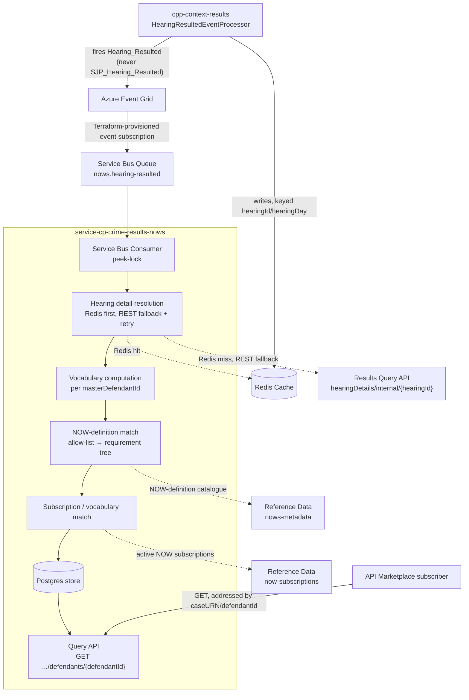
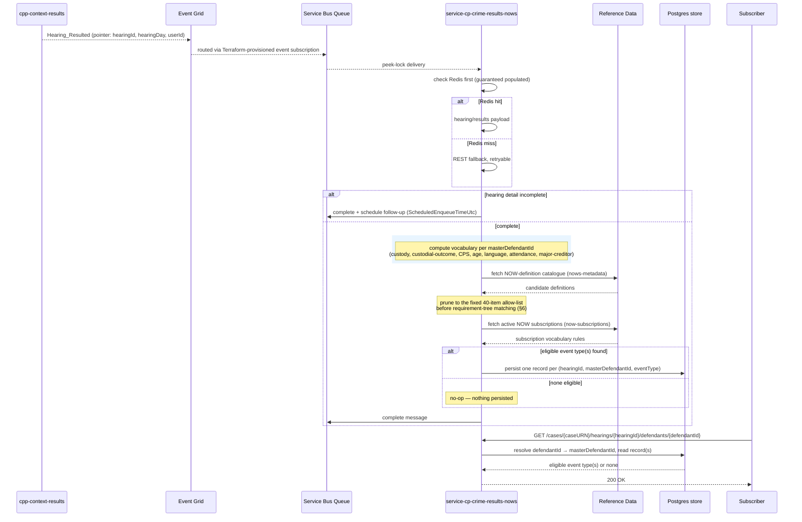
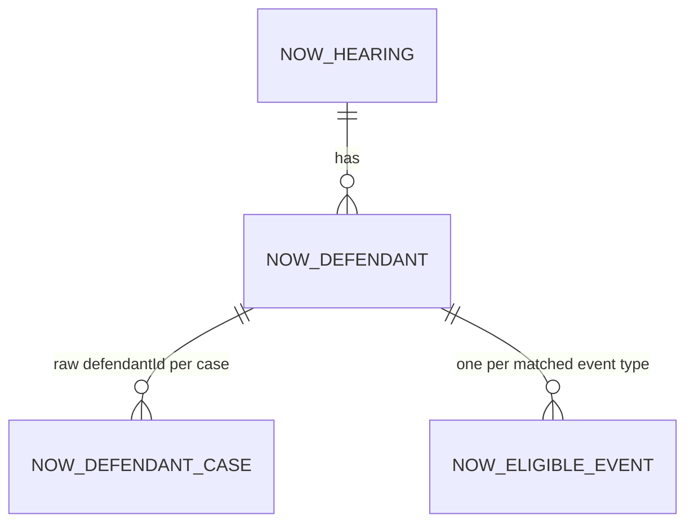

# Notice(s)/Order(s)/Warrant(s) (NOWs) API Marketplace Service — Design

**Trigger:** Azure Event Grid's `Hearing_Resulted` notification — never `SJP_Hearing_Resulted`
(§4a).

**Repos:** `api-cp-crime-results-nows` (OpenAPI spec) + `service-cp-crime-results-nows` (Spring
Boot service), Modern-by-Default pattern.

**Status:** Draft, 28 Aug 2026.
**Jira:** AMP-907 — see [`ADR-003`](../pipeline/adrs/003-nows-api-marketplace-service-design.md)
for the decision this design is accepted under, [`ADR-001`](../pipeline/adrs/001-hearing-resulted-queue-ingestion-for-nows-read-api.md)
for ingestion/store shape, [`ADR-002`](../pipeline/adrs/002-now-generation-gate-scope-and-record-keying.md)
for generation-gate scope and record keying. Decisions already made there are cross-referenced,
not restated.

---

## 1. Purpose

Give API Marketplace subscribers programmatic, pull-based access to NOW (Notice/Order/Warrant)
generation-eligibility data — which registered NOW document type(s) would be generated for a
hearing/defendant, sourced from the same `Hearing_Resulted` signal the existing generation
pipeline already reacts to. This service decides eligibility; it does not generate documents,
resolve recipients, or replace existing distribution.

---

## 2. Unit of work: one record per matched event type, per merged defendant

A single hearing can yield zero, one, or several eligible NOW event types for one defendant —
unlike a capability with one document shape per defendant. Eligibility is computed per
`(hearingId, masterDefendantId)` — the merged identity across every prosecution case and court
application sharing that defendant's master identity on the hearing (ADR-002) — and a record is
persisted **per matched event type** within that pair, not one row bundling all matches together.

The external contract addresses a resource by `caseURN`/`defendantId` — the identifiers a
subscriber already holds — never by `masterDefendantId`, which is an internal merge key. Resolving
one to the other is this service's responsibility (§8a, §10).

---

## 3. Architecture overview

### 3a. Components

### 3b. Sequence — one hearing, end to end

---

## 4. Trigger — Event Grid `Hearing_Resulted`

### 4a. Confirmed, from reading the actual source

- `HearingResultedEventProcessor` (`cpp-context-results`) fans one domain event out to exactly one
  of two mutually-exclusive Event Grid event types, branching on `hearing.isSJPHearing`: `Hearing_Resulted`
  for ordinary hearings, `SJP_Hearing_Resulted` for Single Justice Procedure ones. NOW generation
  has no SJP code path at all in the legacy system — verified directly against the legacy SJP
  orchestrator, which calls zero NOW-related activities. This service therefore only ever needs
  `Hearing_Resulted`.
- The same Redis cache the legacy NOW pipeline's own first orchestration step reads from is
  written synchronously by `HearingResultedEventProcessor`, before the Event Grid event fires —
  guaranteed populated by the time `Hearing_Resulted` is delivered. The Results context viewstore
  (what a REST fallback would read) is updated asynchronously and can race.

### 4b. What this requires

Hearing-detail resolution needs the same Redis-first, REST-fallback-with-retry shape, for the same
reason: a REST call landing before the viewstore catches up is not proven to fail cleanly rather
than return an incomplete result — this needs confirming against the Results team's actual
behaviour before retry logic is finalised (§13).

### 4c. Why a dedicated Service Bus queue, not a direct Event Grid subscription on this service

Settled in ADR-001: Event Grid is push-only with no pull-subscription model; receiving it directly
would require this service to implement Event Grid's subscription-validation handshake and own a
public HTTPS endpoint of its own. Routing through a Terraform-provisioned Service Bus queue instead
needs zero Event Grid-specific code in this service — native `maxDeliveryCount`/dead-lettering
replace hand-rolled retry, and competing-consumer semantics give scale-out for free.

---

## 5. Legacy pipeline analysis — what to port, what not to

Read directly against the legacy Azure Functions NOW pipeline, to separate genuine
eligibility-decision logic from generation/delivery machinery that happens to sit alongside it.

### 5a. Port this — genuine eligibility-decision logic

| Component | What it does | Port as |
|---|---|---|
| Defendant merge by `masterDefendantId` | Merges results across every prosecution case and court application sharing one defendant's master identity on a hearing | The vocabulary computation's merge scope (§2) |
| Vocabulary computation | Custody location, custodial-outcome, CPS-prosecution, age group, court language, attendance (matched against real per-day attendance records), major-creditor status | The vocabulary component (§3a) |
| NOW-definition requirement matching | Matches a judicial result's type identifier against a NOW template's nested requirement tree | The NOW-definition match component (§6) |
| Subscription vocabulary/rule matching | Matches computed vocabulary and per-definition include/exclude lists against active subscriptions | The subscription match component — the actual generation gate (§6) |

### 5b. Do not port — generation, delivery, and audience concerns

| Component | What it actually does | Why it's out of scope |
|---|---|---|
| Audience-specific variant cloning | Produces multiple redacted copies of one NOW per user group (e.g. CPS, Defence, Judiciary) | Recipient/content-redaction concern, not an eligibility decision |
| MDE offence-filtering split | Further splits a NOW variant by offence-level rules | Document-assembly concern |
| EDT sibling-channel routing | Routes a subset of subscriptions to a separate distribution channel | A different distribution channel entirely, not this service's contract |
| Document assembly and template payload building | Builds the actual document request payload | Generation/delivery, not eligibility |
| Reshare/amendment gate (regenerate only if a financial result was amended/deleted) | Decides whether a resend counts as a new NOW | Deferred — this service's first phase covers original shares only (§12) |

---

## 6. Generation-gate matching mechanism

Two independent reference-data lookups, in this order:

1. **Fetch the NOW-definition catalogue** (`nows-metadata`) for the hearing's date. Each entry
   carries a template name and a nested requirement tree keyed by judicial-result-type identifiers.
2. **Prune to the fixed, static 40-item allow-list** — the NOW event types already registered as
   subscriber-routable elsewhere — *before* any requirement-tree matching runs. Anything outside
   this list is discarded here; it is never computed against or reported.
3. **Match the hearing's judicial-result type identifiers** against the pruned candidates'
   requirement trees, to determine which event type(s) apply.
4. **Fetch active NOW subscriptions** (`now-subscriptions`) for the hearing's date and match each
   candidate event type's vocabulary/include-exclude rules against the computed vocabulary (§5a).
5. Persist one record per event type that survives both matches.

The allow-list is a maintained constant in this service, not fetched from the downstream
subscriber-routing system at runtime — that would make this service depend on a downstream
consumer's own data. It needs manual updating if that system registers a new type later; an
accepted, infrequent maintenance cost.

---

## 7. Record identity — no versioning in this phase

Because reshare/amendment handling is deferred (§5b, §12), a record represents a single
generation-eligibility decision per `(hearingId, masterDefendantId, eventType)` — not a version
history. Re-delivery of the same message (native redelivery, or a scheduled completeness-retry
follow-up) should resolve to the same record, not a new one; the exact idempotency mechanism
(upsert vs. existence check before insert) is an implementation detail, not yet decided.

If reshare/amendment handling is built in a later phase, this identity model will need revisiting
— not assumed compatible with it today.

---

## 8. APIM / Modern-by-Default layering

| Layer | Responsibility | Ports from |
|---|---|---|
| **Service Bus Consumer** | Peek-lock receipt off `nows.hearing-resulted`, native redelivery/dead-lettering, scheduled completeness-retry follow-up | New (ADR-001) |
| **Hearing detail resolution** | Redis-first, REST-fallback-with-retry lookup of the actual hearing/results payload | Mirrors the legacy pipeline's own first step |
| **Vocabulary component** | Per-`masterDefendantId` fact computation | Legacy vocabulary computation (§5a) |
| **NOW-definition match component** | Which event type(s) a judicial result could trigger, pruned to the allow-list | Legacy NOW-definition requirement matching (§5a, §6) |
| **Subscription match component** | Whether a candidate event type is actually eligible | Legacy subscription/vocabulary matching (§5a, §6) |
| **Data store** | One row per `(hearingId, masterDefendantId, eventType)` — schema in §8a | New |
| **Query API (controller)** | `GET` endpoint, addressed by `caseURN`/`defendantId` | New |

### 8a. Data model — proposed, not yet migrated

- **`now_hearing`** — `id` (surrogate PK), `hearing_id`, `hearing_day`, `created_at` — unique on
  `hearing_id`.
- **`now_defendant`** — `id` (surrogate PK), `now_hearing_id` (FK), `master_defendant_id`,
  `created_at` — unique on `(now_hearing_id, master_defendant_id)`. The merged-identity row §2
  describes.
- **`now_defendant_case`** — `id`, `now_defendant_id` (FK), `case_urn`, `defendant_id` (the raw,
  per-case identifier) — unique on `(case_urn, defendant_id)`. This is the `defendantId →
  masterDefendantId` resolution table the read path needs (§10); populated at ingestion time from
  the same merge computation that builds `now_defendant`.
- **`now_eligible_event`** — `id`, `now_defendant_id` (FK), `event_type`, `matched_at` — unique on
  `(now_defendant_id, event_type)`.

No PII columns proposed here — this schema stores eligibility outcomes only (event types matched),
not defendant content. If a future phase needs to carry NOW content itself, that's a separate
schema decision, not an extension of this one.

---

## 9. Drift detection

This is a reimplementation of legacy eligibility logic, not a call-through to it, so drift between
the two is possible even with careful porting. The same golden-master approach is worth applying
here: pick real hearings with a known legacy NOW outcome, feed the equivalent payload through this
service's real matching code, and assert the resulting event-type set matches. Not yet built —
recorded as a recommendation, not a commitment.

---

## 10. Query API

- `GET /cases/{caseURN}/hearings/{hearingId}/defendants/{defendantId}` — resolves `defendantId` to
  its `masterDefendantId` via `now_defendant_case` (§8a), then returns the eligible NOW event
  type(s) recorded for that pair, or an empty result if none. Whether "none" is a `200` with an
  empty array or a `404` is not yet decided (§13).
- Response shape (illustrative — `api-cp-crime-results-nows`'s OpenAPI contract is not yet
  authored): an array of `{ eventType, matchedAt }` entries.

---

## 11. Retention

Not yet decided. No retention window or purge mechanism has been discussed for this service —
flagged as an open item (§13), not assumed to mirror any other service's policy.

---

## 12. MVP scope (recommended, not yet confirmed)

Original shares only — no reshare/amendment handling (§5b, §7) — to ship an early, narrower slice
before the reshare gate and any version-correlation mechanism are designed. This mirrors the
reasoning already applied to record identity (§7): building amendment handling before an identity
model exists to support it would be building on an undecided foundation.

---

## 13. Cross-team dependencies & open items

| # | Item | Owner / needs input from |
|---|---|---|
| 1 | Confirm whether the REST fallback fails cleanly or returns an incomplete/stale result with no error when it races the viewstore | Results context team |
| 2 | Empty-result response shape: `200` with empty array, or `404` | Product/tech-arch decision |
| 3 | `defendantId → masterDefendantId` resolution and idempotency mechanism for re-delivered messages | This team |
| 4 | Retention window and purge mechanism | Product decision, unresolved |
| 5 | Reshare/amendment handling and any resulting version-correlation mechanism | Deferred, not yet scoped |
| 6 | Manual sync process for the fixed event-type allow-list against the downstream subscriber-routing system's registered types | This team + that system's owner |

---

## 14. Explicitly out of scope

- Recipient resolution, audience-specific variant cloning, and document assembly/submission (§5b).
- The EDT sibling distribution channel (§5b).
- Reshare/amendment handling (§5b, §7, §12).
- Rebuilding subscriber registration or push notification — owned elsewhere.

---

## 15. References

- `cpp-context-results`'s `HearingResultedEventProcessor` — source of the `Hearing_Resulted`/
  `SJP_Hearing_Resulted` event-type split (§4a).
- The legacy Azure Functions NOW pipeline — source of the vocabulary computation, NOW-definition
  matching, and subscription matching ported in §5a/§6.
