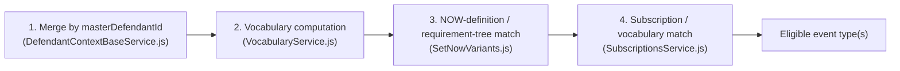
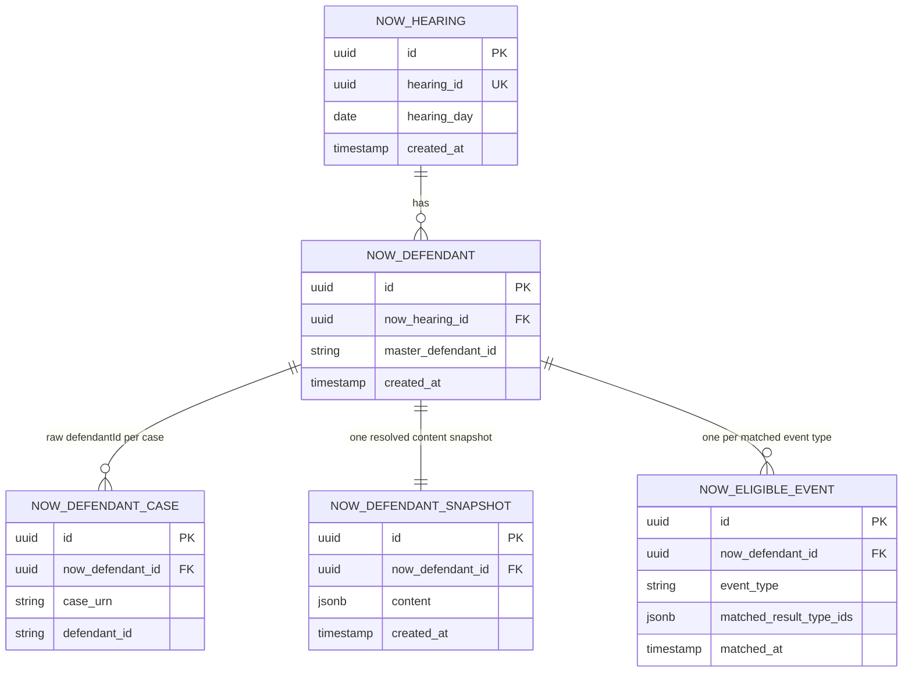

# NOWs Generation-Eligibility Service — Technical Design

**Status:** Draft, 10 Sep 2026.
**Builds on:** [`2026-08-28-nows-api-marketplace-design.md`](./2026-08-28-nows-api-marketplace-design.md)
(the HLD) and the three ADRs it names — [`ADR-001`](../pipeline/adrs/001-hearing-resulted-queue-ingestion-for-nows-read-api.md)
(ingestion/store shape), [`ADR-002`](../pipeline/adrs/002-now-generation-gate-scope-and-record-keying.md)
(generation-gate scope and record keying), [`ADR-003`](../pipeline/adrs/003-nows-api-marketplace-service-design.md)
(service design). This section's decisions are taken as fixed and worked out concretely (exact
classes, exact reference-data endpoints — several of which already exist as real contracts to build
against, §3c/§3d — the DB schema/migrations §5, and the Query API contract, including the refinement
in §6 of what a subscriber must supply beyond `hearingId` alone) — **with one deliberate exception,
below.**

**Scope amendment — this design supersedes ADR-002's "eligibility only, no content" decision.**
ADR-002 states: *"a record is keyed by `(hearingId, masterDefendantId)`... this schema stores
eligibility outcomes only... if a future phase needs to carry NOW content itself, that's a separate
schema decision, not an extension of this one."* That later phase starts now: the per-defendant
Query API response (§6a) returns full resolved content — not just which event types matched — shaped
like `api-cp-crime-results-pcr`'s own `PcrHearingResult`, but with raw `judicialResultTypeId` and
`promptReference`-keyed prompts preserved instead of PCR's flattened `resultTexts[].label/value`.
This is a direct, deliberate response to `analysis/gaps/api-response-gaps.md` (§8): that register
found 206 distinct merge fields across the 40 NOW templates that PCR's public contract can't supply
(no stable `promptReference` key, no judicial-result-type UUIDs) — fields this service's own ingested
data already carries, because it isn't bound by PCR's flattened public shape. The hearing-scoped list
endpoint (§6b) stays eligibility-only, deliberately — see §6b for why the two endpoints now carry
different amounts of content, not the same shape at two granularities. §5 (persistence), §7
(compliance), and §8 (traceability) are rewritten accordingly; ADR-001 (own Postgres store, not
proxied live) and every other decision in ADR-002/ADR-003 are unaffected.

**Sources consulted directly, not just the HLD:**
- This repo's current code (`src/main/java/uk/gov/hmcts/cp`) — the ingestion path, decision-engine
  stub, and domain model are already scaffolded (§1).
- `cpp-context-azure-legalaidagency`'s legacy Azure Durable Functions pipeline
  (`azure-functions/durable-functions/`) — the actual defendant-merge, vocabulary, requirement-tree
  and subscription-matching source this design ports (§3).
- `service-cp-crime-results-pcr` — confirms the real shape of the `now-subscriptions` reference-data
  endpoint and proves the matching approach is Java-portable, but its vocabulary/matcher classes
  were purpose-built for PCR's own narrower `isPrisonCourtRegisterSubscription` check and are **not
  reused** here; NOWs implements its own, ported directly from the legacy JS source (§3b/§3d).
- `service-cp-crime-hearing-results-document-subscription` — owns the authoritative `event_type`
  table and a `GET /event-types` endpoint the fixed 40-item allow-list should be sourced from (§3e).

---

## 1. Where this repo already stands

Confirmed by reading the code, not assumed from the HLD:

| Component | State | File |
|---|---|---|
| Service Bus consumer (peek-lock, redelivery, completeness-retry follow-up) | **Built** | `servicebus/services/HearingResultedServiceBusConsumer.java` |
| Redis-first / REST-fallback hearing-detail resolution | **Built** | `services/ingestion/NowsIngestionService.java`, `clients/HearingResultedCacheClient.java`, `clients/ResultsClient.java` |
| Domain model for the `hearingDetails/internal` payload | **Built**, carried over from PCR's own model | `domain/HearingDetailsResponse.java` |
| NOW generation gate | **Stub only** — always returns `Set.of()` | `services/nowscompute/NowsDecisionEngine.java` |
| Persistence (Postgres schema/migrations) | **Not started** — no Flyway/JPA dependency in `build.gradle` yet | — |
| Reference-data clients (`nows-metadata`, `now-subscriptions`) | **Not started** — `AppPropertiesBackend` is explicitly trimmed pending this (see its own comment) | `config/AppPropertiesBackend.java:7-9` |
| Query API (`GET .../defendants/{defendantId}`) | **Not started** — no `api-cp-crime-results-nows` OpenAPI artifact exists yet | — |

This design fills in the four "not started" rows, and gives the stubbed decision engine a concrete
algorithm to implement.

---

## 2. One discrepancy to fix before the decision engine can be built

`HearingDetailsResponse.JudicialResult` (this repo) was carried over from `service-cp-crime-results-pcr`'s
own copy of the same shared upstream contract — but PCR's copy has one field this repo's is missing:

```java
// service-cp-crime-results-pcr — domain/HearingDetailsResponse.java:300
private String judicialResultTypeId;
```

This is not a cosmetic gap. Every piece of the generation-gate matching logic below — requirement-tree
matching (§3c) and subscription include/exclude-result lists (§3d) — keys off `judicialResultTypeId`,
never `cjsCode`. Confirmed directly in the legacy source: `SetNowVariants/index.js:60` matches
`resultId === nowRequirement.resultDefinitionId` where `resultId` comes from
`result.judicialResultTypeId`, and PCR's own Java port (`CPNowSubscriptionMatcher.java:101-105`)
matches `JudicialResult::getJudicialResultTypeId` against `includedResults`/`excludedResults`.

**Action:** add `private String judicialResultTypeId;` to this repo's `JudicialResult` (both the
offence-level and hearing-wide `defendantJudicialResults` variants use the same nested class, so one
change covers both) before any decision-engine code is written against it.

---

## 3. The generation-gate algorithm — ported from the legacy pipeline, mapped onto this repo's model

Legacy source: `cpp-context-azure-legalaidagency/azure-functions/durable-functions/`, orchestrated by
`HearingResultedNowsHandler/index.js`. The relevant slice for *eligibility* (not document
assembly/delivery — see HLD §5b) is four steps, each with a direct legacy source and a proposed
Java home in this repo's `services.nowscompute` package.



### 3a. Defendant merge — `MergedDefendant` (proposed), ports `DefendantContextBaseService.js`

The legacy `DefendantContextBase` folds three sources into one record per `masterDefendantId`
(`DefendantContextBaseService.js:58-292`):

1. `prosecutionCases[].defendants[]` — case- and offence-level results, keyed by `defendant.masterDefendantId`.
2. `courtApplications[]` — keyed by `courtApplication.subject.masterDefendant.masterDefendantId`.
3. `hearing.defendantJudicialResults[]` — hearing-wide, keyed by `defendantJudicialResult.masterDefendantId`.

All three sources already exist, field-for-field, on this repo's `HearingDetailsResponse` — no new
ingestion contract is needed, only a Java equivalent of the fold:

```java
// proposed: services/nowscompute/MergedDefendant.java
public record MergedDefendant(
        String masterDefendantId,
        boolean isYouth,
        List<String> defendantIds,          // raw per-case ids this master identity spans
        List<JudicialResult> results,        // case + offence + defendant-level + application-level, merged
        List<ProsecutionCase> cases,
        List<CourtApplication> applications) { }
```

Built by walking, in this order, exactly like the legacy fold: `prosecutionCases[].defendants[]`
(`defendant.masterDefendantId`, `defendant.isYouth`, `defendant.defendantCaseJudicialResults` +
`defendant.offences[].judicialResults`) → `courtApplications[]` (`subject.masterDefendant.masterDefendantId`,
`judicialResults`) → `hearing.defendantJudicialResults[]` (`masterDefendantId`, `judicialResult`).

### 3b. Vocabulary computation — NOWs' own implementation, ported directly from `VocabularyService.js`

This is **not** a reuse of `service-cp-crime-results-pcr`'s `domain/pcrcompute/CPVocabulary.java`
and its computation. PCR's port was purpose-built for PCR's own, much narrower gate (a single
`isPrisonCourtRegisterSubscription` check) and is a known-reduced port of the real legacy logic — it
stubs out attendance and major-creditor entirely (see table below). Treating it as a base to extend
risks quietly inheriting those gaps rather than deliberately re-deriving every dimension from the
authoritative source. NOWs instead defines its **own** vocabulary record and computation (e.g.
`domain/nowscompute/NowsVocabulary.java`), authored directly against `VocabularyService.js` for all
seven dimensions, including the two PCR never got right.

PCR's port is still useful — as evidence, not as a base class — that five of the seven dimensions
translate straightforwardly to Java:

| Dimension | PCR's own port (evidence it's portable, not a base class) | What NOWS needs (per ADR-002) | Real source field (already in this repo's model) |
|---|---|---|---|
| Custody location | ✅ full (`custodyLocationIsPolice`/`Prison`, `inCustody`) | Re-derive the same way, independently | `personDefendant.custodialEstablishment.custody` |
| Custodial outcome | ✅ full | Re-derive the same way, independently | `judicialResultPrompts[].promptReference == "prisonOrganisationName"` |
| CPS-prosecution | ✅ full | Re-derive the same way, independently | `prosecutionCase.prosecutor.isCps` |
| Age group | ✅ full | Re-derive the same way, independently | `defendant.isYouth` |
| Court language | ✅ full | Re-derive the same way, independently | `courtCentre.welshCourtCentre` |
| Attendance | ⚠️ **stubbed** — PCR's `CPVocabulary` has no real `appearedInPerson`/`appearedByVideoLink`; `CPNowSubscriptionMatcher.attendanceMatches()` only ever checks `anyAppearance` (`:39-42`) | **Real per-day matching, from day one** — legacy `VocabularyService.getAttendanceInfo()` matches `hearing.defendantAttendance[].attendanceDays[].day` against each merged result's `orderedDate` | `hearing.defendantAttendance[]` (already modeled: `defendantId`, `attendanceDays[].day`/`.attendanceType`) |
| Major-creditor status | ⚠️ **stubbed** — PCR's lists are "always empty" (`CPNowSubscriptionMatcher.java:45`) | Legacy resolves this via a **compliance-enforcement list** (`complianceEnforcementList`, matched by `complianceCorrelationId`) and a **major-creditor reference-data lookup**, neither of which this repo (or PCR) currently calls | Needs `ResultsService.getDefendantAccount` equivalent (`.../results/defendant-gob-account?masterDefendantId=&hearingId=`) plus a new major-creditor reference-data client — **flagged as a design risk, §9** |

Attendance should be implemented for real from day one — this repo already ingests
`defendantAttendance`, so unlike PCR there's no missing upstream contract, only missing wiring, and
no reason to carry PCR's stub forward. Major-creditor genuinely does need two new external calls
this repo doesn't have yet (regardless of which codebase you start from), so it's reasonable to
phase that one dimension behind the rest of the gate — see §9 — but that's a scoping call, not a
reuse one.

### 3c. NOW-definition / requirement-tree matching — new, ports `SetNowVariants.js`

No Java precedent exists for this step (confirmed — neither PCR nor the subscription service model a
requirement tree). Source: `SetNowVariants/index.js:32-100,115-156`.

**Reference-data client (new):** `NowsMetadataClient`, mirroring the shape of PCR's
`ReferenceDataClient` (same base URL, same `CJSCPPUID` header convention) but a different path and
media type, per the legacy JS client (`NowsHelper/service/ReferenceDataService.js:8-31`):

```
GET {referenceDataUrl}/referencedata-query-api/query/api/rest/referencedata/nows-metadata?on={activeAt}
Accept: application/vnd.referencedata.get-nows-metadata+json
CJSCPPUID: {referenceDataCjscppuid}
```

Proposed domain shape (recursive requirement tree, per `nowRequirement.nowRequirements`):

```java
// proposed: domain/nowscompute/NowMetadataResponse.java
public record NowMetadataResponse(List<NowDefinition> nows) { }

public record NowDefinition(
        String id,
        String name,                 // matched against the fixed allow-list, §3e
        boolean includeAllResults,
        List<NowRequirement> nowRequirements) { }

public record NowRequirement(
        String resultDefinitionId,   // matched against JudicialResult.judicialResultTypeId
        boolean primary,
        String parentNowRequirementId,
        String rootResultDefinitionId,
        List<NowRequirement> nowRequirements) { }  // nested — flatten before matching
```

**Matching algorithm** (ports `extractFlattenNowRequirements` + the eligibility test at
`SetNowVariants/index.js:57-73`):

1. Flatten each `NowDefinition`'s nested `nowRequirements` tree into a flat list.
2. A `NowDefinition` is a candidate for a `MergedDefendant` if any of the defendant's merged
   `results[].judicialResultTypeId` equals a flattened requirement's `resultDefinitionId` **and**
   that requirement is `primary`.
3. Candidates are collected as a `Set<NowDefinition>` per merged defendant (a defendant can match
   several NOW definitions from a single hearing — HLD §2).

This same flattened tree also decides *which* of the defendant's results belong in that event type's
**content** (§5b), not just whether it's eligible — ports `filterResults`/`includeAllResults` from
`SetNowVariants/index.js:174-224`: if `NowDefinition.includeAllResults` is true, every merged result
is included; otherwise only results whose `judicialResultTypeId` matches a flattened requirement
(primary or a non-primary child rooted under a matched primary, via `rootResultDefinitionId`) are
included. Record the surviving `judicialResultTypeId`s per candidate — that list is exactly
`now_eligible_event.matched_result_type_ids` in §5b.

### 3d. Subscription / vocabulary matching — NOWs' own matcher, ported directly from `SubscriptionsService.js`

As with §3b, this is **not** a reuse of PCR's `clients/ReferenceDataClient.java`,
`domain/pcrcompute/CPNowSubscription.java`, or `services/pcrcompute/CPNowSubscriptionMatcher.java`.
Those were built for PCR's own single-flag check (`isPrisonCourtRegisterSubscription`) and carry
PCR's own gaps forward (attendance/major-creditor stubbed, §3b) — subclassing, wrapping, or copying
them would import those gaps by default rather than requiring each dimension to be deliberately
re-derived. NOWs builds its own client (e.g. `clients/NowsSubscriptionsClient.java`) and its own DTOs
(e.g. `domain/nowscompute/NowsSubscription.java`, `NowsSubscriptionVocabulary`), and its own matcher
(e.g. `services/nowscompute/NowsSubscriptionMatcher.java`), with every rule re-derived directly from
`SubscriptionsService.js`'s `matchVocabularyRules`/`getSubscriptions` — not from PCR's Java port of
them.

What NOWs' client calls is, as a fact about the Reference Data service's real contract (not a PCR
design choice), the **same endpoint** PCR's client happens to call too:

```
GET {referenceDataUrl}/referencedata-query-api/query/api/rest/referencedata/now-subscriptions?on={activeAt}
Accept: application/vnd.referencedata.query.get-now-subscriptions+json
CJSCPPUID: {referenceDataCjscppuid}
```

Design points for NOWs' own implementation:

1. **NOWs' subscription DTO models `isNowSubscription`/`isEDTSubscription` from the start** — these
   are real fields the reference-data contract returns and the legacy gate reads
   (`SubscriptionsService.js:35`); NOWs' DTO carries them because its own gate needs them, not
   because PCR's DTO is being "extended". NOWs filters to `isNowSubscription` only — EDT is
   explicitly out of scope (HLD §5b/§14).
2. **Filtering is NOWs' own, parallel to (not derived from) PCR's** — where PCR's
   `CPResultsPcrFilter.fetchPrisonCourtRegisterSubscriptions()` filters on
   `isPrisonCourtRegisterSubscription`, NOWs' equivalent independently filters its own fetched list
   on `isNowSubscription`.
3. **Attendance and major-creditor matching are implemented for real, not stubbed** (§3b) — since
   NOWs isn't starting from PCR's matcher, there's no inherited stub to "complete" later; build them
   properly against the legacy source from the outset (attendance), or explicitly phase
   major-creditor behind the rest of the gate as a known, deliberate scope decision (§9) — not as an
   accidental carry-over of PCR's always-empty lists.
4. **`includedNOWS`/`excludedNOWS`/`userGroupVariants`** (legacy `matchSubscriptionRules()`,
   `SubscriptionsService.js:61-78`) are **not** needed — those gate per-recipient/user-group variant
   selection, which is explicitly out of scope (HLD §5b, §14). Only `matchVocabularyRules()`'s rule
   chain applies here.

A `NowDefinition` candidate (§3c) is eligible once **any** subscription with `isNowSubscription` and
`applySubscriptionRules` matches the merged defendant's `NowsVocabulary` and result set — mirroring
`getSubscriptions()`'s `isNowSubscription` branch (`SubscriptionsService.js:14-45`) directly,
simplified since NOWS reports eligibility only, not which specific subscription(s) would receive it.

### 3e. Pruning to the fixed 40-item allow-list

ADR-002 requires this pruning to happen **before** requirement-tree matching (§3c), and the
allow-list to be a static constant, never fetched at runtime. The authoritative source for that list
already exists and is queryable today:

```
GET /event-types   (api-cp-crime-hearing-results-document-subscription)
→ { events: [ { eventName, displayName, category } ] }   — 41 rows currently
```

Backed by `service-cp-crime-hearing-results-document-subscription`'s `event_type` table
(`db/migration/V1.005__add_event_type_table.sql`) — `event_name` is exactly the string form
(`WEE_CustodialSentence`, `NEE_FootballBanning`, …) `NowDefinition.name` must be pruned against.

**Recommendation:** don't hand-maintain the allow-list from scratch. Generate the static constant
from a one-off call to `GET /event-types` (a build-time or manual refresh step, per ADR-002's
accepted "infrequent manual sync" cost — HLD §13 item 6), e.g.:

```java
// proposed: services/nowscompute/RegisteredNowEventTypes.java
public final class RegisteredNowEventTypes {
    // Sourced from GET /event-types on api-cp-crime-hearing-results-document-subscription.
    // Refresh manually if that service registers a new event type (ADR-002) — kept in a single
    // named constant, never fetched at runtime.
    public static final Set<String> ALLOW_LIST = Set.of(
            "WEE_CustodialSentence", "NEE_FootballBanning", /* … all 41 */);
}
```

Note the count is **41**, not 40 as the HLD's "fixed 40-item allow-list" states (one row,
`PRISON_COURT_REGISTER_GENERATED`, is a `REGISTER`-category entry, not a NOW document type at all,
and should be excluded from the NOWS allow-list — leaving 40 genuine `WARRANT`/`NOTICE`/`ORDER`
entries, consistent with the HLD). Filter on `category != 'REGISTER'` when generating the constant.

---

## 4. Idempotency and record identity

Per ADR-002/HLD §7, a record is `(hearingId, masterDefendantId, eventType)` with no version history
in this phase. Re-delivery (native Service Bus redelivery, or the consumer's own scheduled
completeness-retry follow-up — `HearingResultedServiceBusConsumer.MAX_COMPLETENESS_RETRIES`) must
resolve to the same row. Recommendation: a native Postgres upsert
(`INSERT … ON CONFLICT (now_defendant_id, event_type) DO NOTHING`) on `now_eligible_event`, so
re-processing the same hearing is a no-op rather than a duplicate-key error or a second row.
`now_defendant_snapshot` (§5b) needs the equivalent on `now_defendant_id`
(`ON CONFLICT (now_defendant_id) DO UPDATE SET content = excluded.content` — an update, not a no-op,
since a re-delivery could in principle carry a refreshed payload) rather than failing on its own
unique constraint.

---

## 5. Persistence — schema and migrations




Surrogate keys are application-generated `UUID`s, not `BIGSERIAL`, matching this codebase's own
convention (`service-cp-crime-hearing-results-document-subscription`'s `client`/`client_hmac`/
`hearing_event_*` tables all key on `uuid PRIMARY KEY NOT NULL`, supplied by the application, not a
DB-generated default) — kept consistent here rather than introducing a second ID convention.

```sql
-- V1.001__create_now_hearing.sql
CREATE TABLE now_hearing (
    id UUID PRIMARY KEY NOT NULL,
    hearing_id UUID NOT NULL,
    hearing_day DATE NOT NULL,
    created_at TIMESTAMPTZ NOT NULL DEFAULT now(),
    CONSTRAINT uq_now_hearing_hearing_id UNIQUE (hearing_id)
);

-- V1.002__create_now_defendant.sql
CREATE TABLE now_defendant (
    id UUID PRIMARY KEY NOT NULL,
    now_hearing_id UUID NOT NULL REFERENCES now_hearing(id),
    master_defendant_id VARCHAR(64) NOT NULL,
    created_at TIMESTAMPTZ NOT NULL DEFAULT now(),
    CONSTRAINT uq_now_defendant_hearing_master UNIQUE (now_hearing_id, master_defendant_id)
);

-- V1.003__create_now_defendant_case.sql
-- The defendantId -> masterDefendantId resolution table the read path needs (§6).
CREATE TABLE now_defendant_case (
    id UUID PRIMARY KEY NOT NULL,
    now_defendant_id UUID NOT NULL REFERENCES now_defendant(id),
    case_urn VARCHAR(64) NOT NULL,
    defendant_id VARCHAR(64) NOT NULL,
    CONSTRAINT uq_now_defendant_case_urn_defendant UNIQUE (case_urn, defendant_id)
);
```

### 5b. Content snapshot — new, carries PII (§ scope amendment above)

One row per `now_defendant`, written once at ingestion time (the same moment the decision gate
already holds the full merged defendant + hearing detail in hand — §3a — so this is not a second
fetch, just persisting what's already resolved). `content` is a single `jsonb` document shaped like
PCR's `PcrHearingResult` (`prosecutionCase`, `defendant`, `hearing`, `offences[]`,
`courtApplications[]` — same top-level shape a consumer already calling PCR will recognise), with two
deliberate departures from PCR's public schema — both are exactly what §8's gap-closing depends on:

- Each result keeps its raw **`judicialResultTypeId`**, not just a derived `resultDescription`.
- Each prompt keeps its raw **`promptReference`**, not just PCR's flattened `resultTexts[].label`/`.value`
  pair.

```sql
-- V1.004__create_now_defendant_snapshot.sql
CREATE TABLE now_defendant_snapshot (
    id UUID PRIMARY KEY NOT NULL,
    now_defendant_id UUID NOT NULL REFERENCES now_defendant(id),
    content JSONB NOT NULL,
    created_at TIMESTAMPTZ NOT NULL DEFAULT now(),
    CONSTRAINT uq_now_defendant_snapshot_defendant UNIQUE (now_defendant_id)
);
```

`jsonb`, not a fully normalized column-per-field schema — deliberately. `analysis/mappingResults`
alone catalogues 226 distinct merge fields across 40 templates with materially different shapes;
normalizing all of them into columns/child tables up front is disproportionate to what's known today,
and would need revisiting every time a template's field set changes. `jsonb` still supports indexed
querying (`content -> 'defendant' ->> 'dateOfBirth'`, etc.) if a future need for it shows up.

### 5c. Eligible event, extended with which results back it

```sql
-- V1.005__create_now_eligible_event.sql
CREATE TABLE now_eligible_event (
    id UUID PRIMARY KEY NOT NULL,
    now_defendant_id UUID NOT NULL REFERENCES now_defendant(id),
    event_type VARCHAR(128) NOT NULL,
    matched_result_type_ids JSONB NOT NULL,
    matched_at TIMESTAMPTZ NOT NULL DEFAULT now(),
    CONSTRAINT uq_now_eligible_event_defendant_type UNIQUE (now_defendant_id, event_type)
);
```

`matched_result_type_ids` is the `judicialResultTypeId` list §3c's `filterResults`/`includeAllResults`
port already computed while deciding eligibility — persisting it means the Query API (§6) can build a
NOW type's filtered content straight from `now_defendant_snapshot.content` at read time, without a
second call to `nows-metadata` or re-running the requirement-tree match. This is the mechanism that
lets one shared per-defendant snapshot serve several differently-filtered event types (HLD §2 — a
defendant can match more than one), without storing a full duplicate copy of `content` per event type.

This does mean `now_defendant_snapshot`/`now_eligible_event` together now carry defendant PII at
rest, not just eligibility outcomes — see §7's updated compliance note.

---

## 6. Query API — refined contract


`GET /cases/{caseURN}/hearings/{hearingId}/defendants/{defendantId}` — the same
`caseURN`/`hearingId`/`defendantId` addressing scheme `api-cp-crime-results-pcr` already uses
(`openapi-spec.yml:41-58` there), for exactly the same reason: `defendantId` is a **raw, per-case**
unique on its own, so a lookup that only supplies `defendantId` is ambiguous without also pinning the
case it belongs to.

Response — built from `now_defendant_snapshot.content` (§5b), with each eligible event type's own
`offences`/`results` filtered down using its `matched_result_type_ids` (§5c):

```json
{
  "caseURN": "RC363968376",
  "defendant": {
    "id": "d2151771-41a1-42e1-af36-a99d9b39c0b2",
    "masterDefendantId": "d2151771-41a1-42e1-af36-a99d9b39c0b2",
    "title": "Mr", "firstName": "Lacy", "middleName": null, "lastName": "Braun",
    "dateOfBirth": "1998-09-02",
    "address": { "address1": "221B Baker Street", "address2": "Baker Street", "address3": "Marylebone", "address4": null, "address5": null, "postCode": "NW1 5BR" },
    "gender": "MALE", "nationality": null
  },
  "hearing": {
    "id": "6988027f-e786-49f4-a00f-7c35ab459464",
    "courtDetails": { "court": { "courtHouseName": "Lavender Hill Magistrates' Court" }, "ljaName": "South West London Magistrates' Court" },
    "hearingDate": "2026-09-02",
    "jurisdiction": "MAGISTRATES"
  },
  "eligibleEventTypes": [
    {
      "eventType": "WEE_CustodialSentence",
      "orderName": "Warrant for Custodial Sentence",
      "matchedAt": "2026-09-02T18:05:00Z",
      "offences": [
        {
          "code": "TH68013A",
          "title": "Attempt theft of motor vehicle",
          "wording": "Attempt theft to vehicle",
          "convictionDate": "2026-09-02",
          "results": [
            {
              "judicialResultTypeId": "3f8e2a10-9c44-4b6a-8f01-2b7d9e5a6c11",
              "cjsCode": "RIBA48",
              "label": "Remanded in custody",
              "orderedDate": "2026-09-02",
              "prompts": [
                { "promptReference": "prisonOrganisationName", "label": "Prison organisation name", "value": "HMP/YOI Durham" }
              ]
            }
          ]
        }
      ]
    }
  ]
}
```

Note what changed from PCR's `PcrHearingResult` shape (which this deliberately echoes, not
reinvents): `orderName` comes from `NowDefinition.name` (§3c) — data this service already holds and
PCR has no reason to — and each result keeps `judicialResultTypeId`, each prompt keeps
`promptReference`, instead of PCR's derived `resultDescription`/flattened `resultTexts[]`. This is
the concrete mechanism §8 describes.

### 6b. The gap: a consumer who only has `hearingId`

This is a real, common case — a subscriber reacting to `Hearing_Resulted` (or any event carrying just
a `hearingId`) does not necessarily already know which of the hearing's defendants, across however
many prosecution cases and applications, are on it. Forcing them to already hold `caseURN` +
`defendantId` just to make the first call is circular for that consumer.

**Recommendation: add a second, hearing-scoped list endpoint, and keep the existing one.**

```
GET /hearings/{hearingId}
```

Returns eligible event types for **every** defendant on the hearing, grouped by the same external
identifiers (`caseURN`, `defendantId`) the granular endpoint uses — never by `masterDefendantId`,
which stays a purely internal merge key (ADR-002) and must never appear in a request or response.

```json
[
  {
    "caseURN": "OG231065167",
    "defendantId": "86fc543b-4090-43f3-bd6d-8c1522844c99",
    "eligibleEventTypes": [
      { "eventType": "WEE_CustodialSentence", "matchedAt": "2026-09-10T09:12:03Z" }
    ]
  }
]
```

**This endpoint stays eligibility-only — no `content` field — even though §6a's endpoint now returns
full content.** That's a deliberate two-tier split, not an oversight or a leftover from before the
scope amendment: PCR never exposes a hearing-wide list at all, precisely because its payload carries
defendant PII (address, DOB) that should stay scoped to one consumer-already-known defendant, not
broadcast across every defendant on a hearing to a consumer who only supplied a `hearingId`. Now that
§6a's per-defendant response carries the same kind of PII, the same reasoning applies here just as
much as it does to PCR — so this endpoint keeps doing what it always did (event types + `matchedAt`,
nothing else), and a consumer who wants content has to first discover *which* `caseURN`/`defendantId`
they need from this thin list, then call §6a's endpoint for that specific one. This mirrors exactly
how a consumer would use PCR's own contract today — list/discover thin, fetch rich once scoped.

Keep `GET /cases/{caseURN}/hearings/{hearingId}/defendants/{defendantId}` too — it's now the *only*
endpoint that returns content, for consumers who already know exactly which defendant they care about
— and for parity with PCR's own contract shape, which some subscribers will already be calling
alongside this one.

### 6c. Parameters, resolved

| Parameter | Needed? | Where | Reasoning |
|---|---|---|---|
| `hearingId` | **Required**, both endpoints | path | The one identifier a consumer is guaranteed to hold from the triggering event. |
| `caseURN` | Required only on the per-defendant endpoint; **absent** on the hearing-list endpoint | path | Only needed to disambiguate `defendantId`, which is not globally unique (§6a). The list endpoint sidesteps this by returning `caseURN` per row instead of requiring it as input. |
| `defendantId` | Required only on the per-defendant endpoint | path | Same reasoning as `caseURN` — the two are a pair, never supplied alone. |
| `masterDefendantId` | **Never** accepted, on either endpoint | — | Internal merge key only (ADR-002); exposing it as a request or response field would leak an implementation detail a subscriber has no way to independently obtain anyway. |
| `hearingDay` | **Never** accepted at the API boundary | — | An ingestion-time correlation input (from the `Hearing_Resulted` event's own `data.hearingDay`, used only for the Redis cache key at ingestion) — not something a read-side subscriber holds or should need to supply. |
| `eventType` (filter) | Optional, both endpoints | query | On the hearing-list endpoint (§6b), lets a subscriber interested in one document type narrow the response without post-filtering client-side. On the per-defendant endpoint (§6a), narrows `eligibleEventTypes[]` down to one entry — now worth having there too, since that payload carries full content per matched event type rather than the small eligibility-only record it used to be. |
| `caseURN` (filter) | Optional, hearing-list endpoint only | query | Lets a subscriber narrow a multi-case hearing to one case without switching to the per-defendant endpoint (which still needs `defendantId` too). |
| Pagination (`page`/`size`) | Not recommended for now | — | A hearing typically has one defendant, occasionally a handful in a joint trial — no evidence of hearings with enough defendants to need paging. Flagged as an open item if that assumption turns out wrong (§9). |
| `asOf` / version param | Not applicable in this phase | — | No version history exists yet (§4/HLD §7) — one live record per `(hearingId, masterDefendantId, eventType)`. Revisit if/when reshare/amendment handling (HLD §12) is designed. |

### 6d. Empty-result and not-found semantics

HLD §13 item 2 leaves this open; this design proposes a concrete answer, consistent across both
endpoints:

- **`200` with an empty array** — the hearing (or defendant) is known to this service (it was
  ingested), but zero event types matched. This is a normal, common outcome, not an error.
- **`404`** — reserved for a `hearingId` this service has never ingested at all (no matching
  `now_hearing` row) — e.g. the hearing hasn't fired `Hearing_Resulted` yet, or predates this
  service's go-live. For the per-defendant endpoint, `404` also covers a `caseURN`/`defendantId` pair
  with no matching `now_defendant_case` row under a hearing that *is* known.

---

## 7. Non-functional carry-overs from the HLD (not restated in full)

- **Compliance — updated for the scope amendment above.** `now_defendant_snapshot` (§5b) now
  persists defendant PII at rest — name, DOB, address, offence and result detail — not just
  eligibility outcomes. OFFICIAL-SENSITIVE from day one (already ADR-001's posture for the ingestion
  path; now the store itself is in scope too, the same as PCR's own store already is). No PII in
  logs or error responses, same rule as before, now with more to accidentally log — the decision
  gate's own log lines (`NowsIngestionService`/`NowsDecisionEngine`) already key off `defendantId`,
  not name/DOB/address, which is the right pattern to keep.
- **Retention is now a materially higher-priority open item than it was.** HLD §11 left it
  unresolved when the store held eligibility outcomes only; it cannot stay unresolved once the store
  holds defendant PII — this needs a real answer (mirroring whatever retention policy PCR's own
  content-bearing store already follows, if one exists) before this design ships, not just a noted
  gap — see §9.
- **Drift detection:** HLD §9's golden-master recommendation applies directly to §3's ported
  algorithm — pick real hearings with a known legacy NOW outcome and assert this service's matching
  code reproduces the same event-type set. Worth extending to content too: assert the persisted
  `now_defendant_snapshot.content` for a known hearing matches what the legacy pipeline's own mappers
  (`NowDefendantMapper.js`/`OrderCourtMapper.js`/`CaseMapper.js`) would have produced, not just that
  the eligible event-type set matches.

---

## 8. Traceability — this design closes gaps the earlier merge-field analysis found

This repo also holds a merge-field register (`analysis/mappingResults/`, `analysis/gaps/`) built
separately from every Docmosis NOW template, and a consolidated gap list —
`analysis/gaps/api-response-gaps.md` — of every merge field across all 40 templates that PCR's public
API **can't** supply: 81 fields entirely absent from `PcrHearingResult`, 125 more reachable only by
fuzzy-matching a display label (no stable key). Both root causes are named explicitly in that
document: *"the PCR schema has no stable `promptReference` key... and no judicial-result-type UUIDs."*

§5b/§6a's `content` is a direct answer to that gap list, not a parallel, unrelated concern — this
service's own ingested data was never bound by PCR's flattened public shape, so it can carry the two
things PCR structurally cannot:

| Gap category (from `api-response-gaps.md`) | Count | Closed by this design? | How |
|---|---|---|---|
| **Partial** — prompt-keyed fields (`dp.value('promptReference')` etc.) | 125 fields | **Yes** | `content`'s prompts keep raw `promptReference` (§5b) — the exact key PCR's `resultTexts[].label`/`.value` pair discards. |
| **No** — `dr.resultIdentifierExists(...)`/`resultPromptValue(...)` helpers, keyed by `judicialResultTypeId` UUIDs | a subset of the 81 | **Yes, once §2's fix lands** | `content`'s results keep raw `judicialResultTypeId` — absent from this repo's model today, the §2 blocker. |
| **No** — `orderName` (NOW catalogue's own `now.name`) | 1 field, all 40 templates | **Yes** | This service already fetches `nows-metadata` for matching (§3c) — `NowDefinition.name` is right there; PCR has no reason to ever call that endpoint. |
| **No** — `orderDate`/`amendmentdate` (derived from the matched result's own date) | 2 fields, most templates | **Partially** | `orderedDate` is already on `JudicialResult` in this repo's model (§5b's `content.offences[].results[].orderedDate`) — `orderDate` closes. `amendmentDate` has no equivalent field anywhere in this model yet — stays open (§9). |
| **No** — `orderingCourt.ljaCode` | 1 field, most templates | **No — genuine residual gap** | Neither this repo's `HearingDetailsResponse.CourtCentre` nor PCR's `Court` schema carries a separate LJA *code*, only `lja.ljaName` — this isn't a PCR-contract limitation, it's absent from the shared upstream payload itself. Flagged here rather than silently dropped. |
| **No** — `nt.value(...)`/`nrt.value(...)` (NOW catalogue's static requirement text) | remainder of the 81 | **No — out of scope for both** | Static per-template text from the NOW definition catalogue, not hearing/case data at all — a document-generation-time (Docmosis template) concern, unrelated to what either API's data source can supply. |

So: most of the gap list (206 fields total) is closed by this design's `content`, a small remainder
(`ljaCode`, `amendmentDate`, catalogue-static text) genuinely isn't — because the data doesn't exist
anywhere in the ingested payload or the reference-data catalogues this service calls, not because of
a contract choice this design could fix. That residual list is worth carrying into whichever team
owns actual NOW document generation, not solved here.

---

## 9. Open items and risks (in addition to HLD §13)

| # | Item | Why it matters |
|---|---|---|
| 1 | `judicialResultTypeId` missing from this repo's `JudicialResult` (§2) | Blocks §3c/§3d entirely — fix first. |
| 2 | Major-creditor vocabulary dimension needs two new external dependencies (compliance-enforcement list, major-creditor lookup) neither this repo nor PCR currently calls (§3b) | Real scope, not a port — consider phasing behind the rest of the gate rather than blocking it. |
| 3 | NOWs' own subscription DTO must model `isNowSubscription`/`isEDTSubscription` from the start (§3d) | Not a schema change to anything — get it right the first time, since this DTO is authored directly against the reference-data contract, not derived from PCR's narrower one. |
| 4 | Allow-list count is 41 rows in `event_type`, one of which (`PRISON_COURT_REGISTER_GENERATED`) is not a NOW type (§3e) | Filter on `category != 'REGISTER'` when generating the constant, or the allow-list will silently include a non-NOW entry. |
| 5 | Hearing-list endpoint pagination (§6c) | No evidence yet that it's needed — revisit if joint-trial hearing sizes prove otherwise. |
| 6 | `now_defendant`/`now_defendant_case` population timing — built at ingestion from the same merge fold as §3a, but the exact write-path (transactional boundary with `now_eligible_event`/`now_defendant_snapshot`) isn't detailed here | Implementation-level detail for whoever picks this up next, not a design gap. |
| 7 | Retention now unresolved on a store that holds PII, not just eligibility outcomes (§7) | Elevated from HLD §11's original open item — needs an actual answer before this ships, not just a note. |
| 8 | `now_defendant_snapshot.content`'s field set is only proven against §5b/§6a's one worked example, not checked against all 206 fields `analysis/mappingResults` catalogues across 40 templates | Before implementation, walk the full merge-field register and confirm `content`'s shape (or the mapper that builds it) actually carries every field each template needs, not just the ones this design happened to exercise. |
| 9 | `orderingCourt.ljaCode` and `amendmentDate` are genuine residual gaps even after this design (§8) — present in neither the ingested payload nor the reference-data catalogues this service calls | Not solvable within this service's own data sources — needs raising with whichever team owns the upstream `hearingDetails/internal` contract or the NOW-definition catalogue, not deferred silently. |
