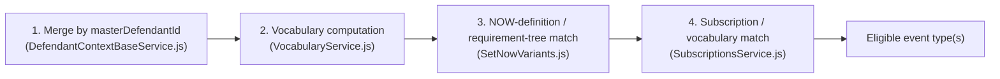
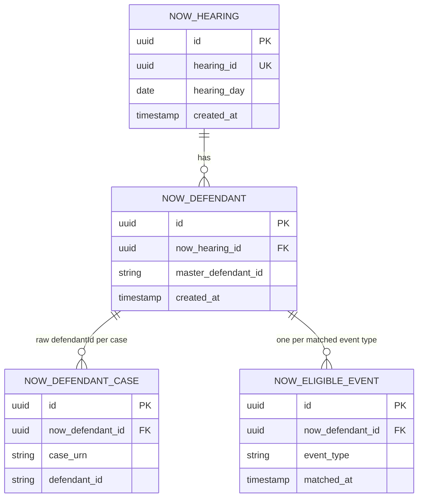

# NOWs Generation-Eligibility Service — Technical Design

**Status:** Draft, 10 Sep 2026.
**Builds on:** [`2026-08-28-nows-api-marketplace-design.md`](./2026-08-28-nows-api-marketplace-design.md)
(the HLD) and the three ADRs it names — [`ADR-001`](../pipeline/adrs/001-hearing-resulted-queue-ingestion-for-nows-read-api.md)
(ingestion/store shape), [`ADR-002`](../pipeline/adrs/002-now-generation-gate-scope-and-record-keying.md)
(generation-gate scope and record keying), [`ADR-003`](../pipeline/adrs/003-nows-api-marketplace-service-design.md)
(service design). Nothing here re-litigates those decisions — it takes them as fixed and works out
the concrete Java implementation: exact classes, exact reference-data endpoints (several of which
already exist as real contracts to build against — §3c/§3d), the DB schema/migrations (§5), and the
Query API contract, including the refinement in §6 of what a subscriber must supply beyond
`hearingId` alone.

**Sources consulted directly, not just the HLD:**
- This repo's current code (`src/main/java/uk/gov/hmcts/cp`) — the ingestion path, decision-engine
  stub, and domain model are already scaffolded (§1).
- `cpp-context-azure-legalaidagency`'s legacy Azure Durable Functions pipeline
  (`azure-functions/durable-functions/`) — the actual defendant-merge, vocabulary, requirement-tree
  and subscription-matching source this design ports (§3).
- `service-cp-crime-results-pcr` — confirms the real shape of the `now-subscriptions` reference-data
  endpoint and proves the matching approach is Java-portable, but its vocabulary/matcher classes
  were purpose-built for PCR's own narrower `isPrisonCourtRegisterSubscription` check and are **not
  reused** here; NOWs implements its own, ported directly from the legacy JS source (§3b/§3d).
- `service-cp-crime-hearing-results-document-subscription` — owns the authoritative `event_type`
  table and a `GET /event-types` endpoint the fixed 40-item allow-list should be sourced from (§3e).

---

## 1. Where this repo already stands

Confirmed by reading the code, not assumed from the HLD:

| Component | State | File |
|---|---|---|
| Service Bus consumer (peek-lock, redelivery, completeness-retry follow-up) | **Built** | `servicebus/services/HearingResultedServiceBusConsumer.java` |
| Redis-first / REST-fallback hearing-detail resolution | **Built** | `services/ingestion/NowsIngestionService.java`, `clients/HearingResultedCacheClient.java`, `clients/ResultsClient.java` |
| Domain model for the `hearingDetails/internal` payload | **Built**, carried over from PCR's own model | `domain/HearingDetailsResponse.java` |
| NOW generation gate | **Stub only** — always returns `Set.of()` | `services/nowscompute/NowsDecisionEngine.java` |
| Persistence (Postgres schema/migrations) | **Not started** — no Flyway/JPA dependency in `build.gradle` yet | — |
| Reference-data clients (`nows-metadata`, `now-subscriptions`) | **Not started** — `AppPropertiesBackend` is explicitly trimmed pending this (see its own comment) | `config/AppPropertiesBackend.java:7-9` |
| Query API (`GET .../defendants/{defendantId}`) | **Not started** — no `api-cp-crime-results-nows` OpenAPI artifact exists yet | — |

This design fills in the four "not started" rows, and gives the stubbed decision engine a concrete
algorithm to implement.

---

## 2. One discrepancy to fix before the decision engine can be built

`HearingDetailsResponse.JudicialResult` (this repo) was carried over from `service-cp-crime-results-pcr`'s
own copy of the same shared upstream contract — but PCR's copy has one field this repo's is missing:

```java
// service-cp-crime-results-pcr — domain/HearingDetailsResponse.java:300
private String judicialResultTypeId;
```

This is not a cosmetic gap. Every piece of the generation-gate matching logic below — requirement-tree
matching (§3c) and subscription include/exclude-result lists (§3d) — keys off `judicialResultTypeId`,
never `cjsCode`. Confirmed directly in the legacy source: `SetNowVariants/index.js:60` matches
`resultId === nowRequirement.resultDefinitionId` where `resultId` comes from
`result.judicialResultTypeId`, and PCR's own Java port (`CPNowSubscriptionMatcher.java:101-105`)
matches `JudicialResult::getJudicialResultTypeId` against `includedResults`/`excludedResults`.

**Action:** add `private String judicialResultTypeId;` to this repo's `JudicialResult` (both the
offence-level and hearing-wide `defendantJudicialResults` variants use the same nested class, so one
change covers both) before any decision-engine code is written against it.

---

## 3. The generation-gate algorithm — ported from the legacy pipeline, mapped onto this repo's model

Legacy source: `cpp-context-azure-legalaidagency/azure-functions/durable-functions/`, orchestrated by
`HearingResultedNowsHandler/index.js`. The relevant slice for *eligibility* (not document
assembly/delivery — see HLD §5b) is four steps, each with a direct legacy source and a proposed
Java home in this repo's `services.nowscompute` package.



### 3a. Defendant merge — `MergedDefendant` (proposed), ports `DefendantContextBaseService.js`

The legacy `DefendantContextBase` folds three sources into one record per `masterDefendantId`
(`DefendantContextBaseService.js:58-292`):

1. `prosecutionCases[].defendants[]` — case- and offence-level results, keyed by `defendant.masterDefendantId`.
2. `courtApplications[]` — keyed by `courtApplication.subject.masterDefendant.masterDefendantId`.
3. `hearing.defendantJudicialResults[]` — hearing-wide, keyed by `defendantJudicialResult.masterDefendantId`.

All three sources already exist, field-for-field, on this repo's `HearingDetailsResponse` — no new
ingestion contract is needed, only a Java equivalent of the fold:

```java
// proposed: services/nowscompute/MergedDefendant.java
public record MergedDefendant(
        String masterDefendantId,
        boolean isYouth,
        List<String> defendantIds,          // raw per-case ids this master identity spans
        List<JudicialResult> results,        // case + offence + defendant-level + application-level, merged
        List<ProsecutionCase> cases,
        List<CourtApplication> applications) { }
```

Built by walking, in this order, exactly like the legacy fold: `prosecutionCases[].defendants[]`
(`defendant.masterDefendantId`, `defendant.isYouth`, `defendant.defendantCaseJudicialResults` +
`defendant.offences[].judicialResults`) → `courtApplications[]` (`subject.masterDefendant.masterDefendantId`,
`judicialResults`) → `hearing.defendantJudicialResults[]` (`masterDefendantId`, `judicialResult`).

### 3b. Vocabulary computation — NOWs' own implementation, ported directly from `VocabularyService.js`

This is **not** a reuse of `service-cp-crime-results-pcr`'s `domain/pcrcompute/CPVocabulary.java`
and its computation. PCR's port was purpose-built for PCR's own, much narrower gate (a single
`isPrisonCourtRegisterSubscription` check) and is a known-reduced port of the real legacy logic — it
stubs out attendance and major-creditor entirely (see table below). Treating it as a base to extend
risks quietly inheriting those gaps rather than deliberately re-deriving every dimension from the
authoritative source. NOWs instead defines its **own** vocabulary record and computation (e.g.
`domain/nowscompute/NowsVocabulary.java`), authored directly against `VocabularyService.js` for all
seven dimensions, including the two PCR never got right.

PCR's port is still useful — as evidence, not as a base class — that five of the seven dimensions
translate straightforwardly to Java:

| Dimension | PCR's own port (evidence it's portable, not a base class) | What NOWS needs (per ADR-002) | Real source field (already in this repo's model) |
|---|---|---|---|
| Custody location | ✅ full (`custodyLocationIsPolice`/`Prison`, `inCustody`) | Re-derive the same way, independently | `personDefendant.custodialEstablishment.custody` |
| Custodial outcome | ✅ full | Re-derive the same way, independently | `judicialResultPrompts[].promptReference == "prisonOrganisationName"` |
| CPS-prosecution | ✅ full | Re-derive the same way, independently | `prosecutionCase.prosecutor.isCps` |
| Age group | ✅ full | Re-derive the same way, independently | `defendant.isYouth` |
| Court language | ✅ full | Re-derive the same way, independently | `courtCentre.welshCourtCentre` |
| Attendance | ⚠️ **stubbed** — PCR's `CPVocabulary` has no real `appearedInPerson`/`appearedByVideoLink`; `CPNowSubscriptionMatcher.attendanceMatches()` only ever checks `anyAppearance` (`:39-42`) | **Real per-day matching, from day one** — legacy `VocabularyService.getAttendanceInfo()` matches `hearing.defendantAttendance[].attendanceDays[].day` against each merged result's `orderedDate` | `hearing.defendantAttendance[]` (already modeled: `defendantId`, `attendanceDays[].day`/`.attendanceType`) |
| Major-creditor status | ⚠️ **stubbed** — PCR's lists are "always empty" (`CPNowSubscriptionMatcher.java:45`) | Legacy resolves this via a **compliance-enforcement list** (`complianceEnforcementList`, matched by `complianceCorrelationId`) and a **major-creditor reference-data lookup**, neither of which this repo (or PCR) currently calls | Needs `ResultsService.getDefendantAccount` equivalent (`.../results/defendant-gob-account?masterDefendantId=&hearingId=`) plus a new major-creditor reference-data client — **flagged as a design risk, §9** |

Attendance should be implemented for real from day one — this repo already ingests
`defendantAttendance`, so unlike PCR there's no missing upstream contract, only missing wiring, and
no reason to carry PCR's stub forward. Major-creditor genuinely does need two new external calls
this repo doesn't have yet (regardless of which codebase you start from), so it's reasonable to
phase that one dimension behind the rest of the gate — see §9 — but that's a scoping call, not a
reuse one.

### 3c. NOW-definition / requirement-tree matching — new, ports `SetNowVariants.js`

No Java precedent exists for this step (confirmed — neither PCR nor the subscription service model a
requirement tree). Source: `SetNowVariants/index.js:32-100,115-156`.

**Reference-data client (new):** `NowsMetadataClient`, mirroring the shape of PCR's
`ReferenceDataClient` (same base URL, same `CJSCPPUID` header convention) but a different path and
media type, per the legacy JS client (`NowsHelper/service/ReferenceDataService.js:8-31`):

```
GET {referenceDataUrl}/referencedata-query-api/query/api/rest/referencedata/nows-metadata?on={activeAt}
Accept: application/vnd.referencedata.get-nows-metadata+json
CJSCPPUID: {referenceDataCjscppuid}
```

Proposed domain shape (recursive requirement tree, per `nowRequirement.nowRequirements`):

```java
// proposed: domain/nowscompute/NowMetadataResponse.java
public record NowMetadataResponse(List<NowDefinition> nows) { }

public record NowDefinition(
        String id,
        String name,                 // matched against the fixed allow-list, §3e
        boolean includeAllResults,
        List<NowRequirement> nowRequirements) { }

public record NowRequirement(
        String resultDefinitionId,   // matched against JudicialResult.judicialResultTypeId
        boolean primary,
        String parentNowRequirementId,
        String rootResultDefinitionId,
        List<NowRequirement> nowRequirements) { }  // nested — flatten before matching
```

**Matching algorithm** (ports `extractFlattenNowRequirements` + the eligibility test at
`SetNowVariants/index.js:57-73`):

1. Flatten each `NowDefinition`'s nested `nowRequirements` tree into a flat list.
2. A `NowDefinition` is a candidate for a `MergedDefendant` if any of the defendant's merged
   `results[].judicialResultTypeId` equals a flattened requirement's `resultDefinitionId` **and**
   that requirement is `primary`.
3. Candidates are collected as a `Set<NowDefinition>` per merged defendant (a defendant can match
   several NOW definitions from a single hearing — HLD §2).

### 3d. Subscription / vocabulary matching — NOWs' own matcher, ported directly from `SubscriptionsService.js`

As with §3b, this is **not** a reuse of PCR's `clients/ReferenceDataClient.java`,
`domain/pcrcompute/CPNowSubscription.java`, or `services/pcrcompute/CPNowSubscriptionMatcher.java`.
Those were built for PCR's own single-flag check (`isPrisonCourtRegisterSubscription`) and carry
PCR's own gaps forward (attendance/major-creditor stubbed, §3b) — subclassing, wrapping, or copying
them would import those gaps by default rather than requiring each dimension to be deliberately
re-derived. NOWs builds its own client (e.g. `clients/NowsSubscriptionsClient.java`) and its own DTOs
(e.g. `domain/nowscompute/NowsSubscription.java`, `NowsSubscriptionVocabulary`), and its own matcher
(e.g. `services/nowscompute/NowsSubscriptionMatcher.java`), with every rule re-derived directly from
`SubscriptionsService.js`'s `matchVocabularyRules`/`getSubscriptions` — not from PCR's Java port of
them.

What NOWs' client calls is, as a fact about the Reference Data service's real contract (not a PCR
design choice), the **same endpoint** PCR's client happens to call too:

```
GET {referenceDataUrl}/referencedata-query-api/query/api/rest/referencedata/now-subscriptions?on={activeAt}
Accept: application/vnd.referencedata.query.get-now-subscriptions+json
CJSCPPUID: {referenceDataCjscppuid}
```

Design points for NOWs' own implementation:

1. **NOWs' subscription DTO models `isNowSubscription`/`isEDTSubscription` from the start** — these
   are real fields the reference-data contract returns and the legacy gate reads
   (`SubscriptionsService.js:35`); NOWs' DTO carries them because its own gate needs them, not
   because PCR's DTO is being "extended". NOWs filters to `isNowSubscription` only — EDT is
   explicitly out of scope (HLD §5b/§14).
2. **Filtering is NOWs' own, parallel to (not derived from) PCR's** — where PCR's
   `CPResultsPcrFilter.fetchPrisonCourtRegisterSubscriptions()` filters on
   `isPrisonCourtRegisterSubscription`, NOWs' equivalent independently filters its own fetched list
   on `isNowSubscription`.
3. **Attendance and major-creditor matching are implemented for real, not stubbed** (§3b) — since
   NOWs isn't starting from PCR's matcher, there's no inherited stub to "complete" later; build them
   properly against the legacy source from the outset (attendance), or explicitly phase
   major-creditor behind the rest of the gate as a known, deliberate scope decision (§9) — not as an
   accidental carry-over of PCR's always-empty lists.
4. **`includedNOWS`/`excludedNOWS`/`userGroupVariants`** (legacy `matchSubscriptionRules()`,
   `SubscriptionsService.js:61-78`) are **not** needed — those gate per-recipient/user-group variant
   selection, which is explicitly out of scope (HLD §5b, §14). Only `matchVocabularyRules()`'s rule
   chain applies here.

A `NowDefinition` candidate (§3c) is eligible once **any** subscription with `isNowSubscription` and
`applySubscriptionRules` matches the merged defendant's `NowsVocabulary` and result set — mirroring
`getSubscriptions()`'s `isNowSubscription` branch (`SubscriptionsService.js:14-45`) directly,
simplified since NOWS reports eligibility only, not which specific subscription(s) would receive it.

### 3e. Pruning to the fixed 40-item allow-list

ADR-002 requires this pruning to happen **before** requirement-tree matching (§3c), and the
allow-list to be a static constant, never fetched at runtime. The authoritative source for that list
already exists and is queryable today:

```
GET /event-types   (api-cp-crime-hearing-results-document-subscription)
→ { events: [ { eventName, displayName, category } ] }   — 41 rows currently
```

Backed by `service-cp-crime-hearing-results-document-subscription`'s `event_type` table
(`db/migration/V1.005__add_event_type_table.sql`) — `event_name` is exactly the string form
(`WEE_CustodialSentence`, `NEE_FootballBanning`, …) `NowDefinition.name` must be pruned against.

**Recommendation:** don't hand-maintain the allow-list from scratch. Generate the static constant
from a one-off call to `GET /event-types` (a build-time or manual refresh step, per ADR-002's
accepted "infrequent manual sync" cost — HLD §13 item 6), e.g.:

```java
// proposed: services/nowscompute/RegisteredNowEventTypes.java
public final class RegisteredNowEventTypes {
    // Sourced from GET /event-types on api-cp-crime-hearing-results-document-subscription.
    // Refresh manually if that service registers a new event type (ADR-002) — kept in a single
    // named constant, never fetched at runtime.
    public static final Set<String> ALLOW_LIST = Set.of(
            "WEE_CustodialSentence", "NEE_FootballBanning", /* … all 41 */);
}
```

Note the count is **41**, not 40 as the HLD's "fixed 40-item allow-list" states (one row,
`PRISON_COURT_REGISTER_GENERATED`, is a `REGISTER`-category entry, not a NOW document type at all,
and should be excluded from the NOWS allow-list — leaving 40 genuine `WARRANT`/`NOTICE`/`ORDER`
entries, consistent with the HLD). Filter on `category != 'REGISTER'` when generating the constant.

---

## 4. Idempotency and record identity

Per ADR-002/HLD §7, a record is `(hearingId, masterDefendantId, eventType)` with no version history
in this phase. Re-delivery (native Service Bus redelivery, or the consumer's own scheduled
completeness-retry follow-up — `HearingResultedServiceBusConsumer.MAX_COMPLETENESS_RETRIES`) must
resolve to the same row. Recommendation: a native Postgres upsert
(`INSERT … ON CONFLICT (now_defendant_id, event_type) DO NOTHING`) on `now_eligible_event`, so
re-processing the same hearing is a no-op rather than a duplicate-key error or a second row.

---

## 5. Persistence — schema and migrations

Schema as proposed in the HLD §8a, made concrete as Flyway migrations (this codebase's house
convention — confirmed via `service-cp-crime-hearing-results-document-subscription`'s
`V1.00X__description.sql` pattern). New `build.gradle` dependencies needed: `spring-boot-starter-data-jpa`,
`flyway-core`, `flyway-database-postgresql`, a Postgres driver — none present yet.



Surrogate keys are application-generated `UUID`s, not `BIGSERIAL`, matching this codebase's own
convention (`service-cp-crime-hearing-results-document-subscription`'s `client`/`client_hmac`/
`hearing_event_*` tables all key on `uuid PRIMARY KEY NOT NULL`, supplied by the application, not a
DB-generated default) — kept consistent here rather than introducing a second ID convention.

```sql
-- V1.001__create_now_hearing.sql
CREATE TABLE now_hearing (
    id UUID PRIMARY KEY NOT NULL,
    hearing_id UUID NOT NULL,
    hearing_day DATE NOT NULL,
    created_at TIMESTAMPTZ NOT NULL DEFAULT now(),
    CONSTRAINT uq_now_hearing_hearing_id UNIQUE (hearing_id)
);

-- V1.002__create_now_defendant.sql
CREATE TABLE now_defendant (
    id UUID PRIMARY KEY NOT NULL,
    now_hearing_id UUID NOT NULL REFERENCES now_hearing(id),
    master_defendant_id VARCHAR(64) NOT NULL,
    created_at TIMESTAMPTZ NOT NULL DEFAULT now(),
    CONSTRAINT uq_now_defendant_hearing_master UNIQUE (now_hearing_id, master_defendant_id)
);

-- V1.003__create_now_defendant_case.sql
-- The defendantId -> masterDefendantId resolution table the read path needs (§7).
CREATE TABLE now_defendant_case (
    id UUID PRIMARY KEY NOT NULL,
    now_defendant_id UUID NOT NULL REFERENCES now_defendant(id),
    case_urn VARCHAR(64) NOT NULL,
    defendant_id VARCHAR(64) NOT NULL,
    CONSTRAINT uq_now_defendant_case_urn_defendant UNIQUE (case_urn, defendant_id)
);

-- V1.004__create_now_eligible_event.sql
CREATE TABLE now_eligible_event (
    id UUID PRIMARY KEY NOT NULL,
    now_defendant_id UUID NOT NULL REFERENCES now_defendant(id),
    event_type VARCHAR(128) NOT NULL,
    matched_at TIMESTAMPTZ NOT NULL DEFAULT now(),
    CONSTRAINT uq_now_eligible_event_defendant_type UNIQUE (now_defendant_id, event_type)
);
```

No PII columns, matching HLD §8a — this store records eligibility outcomes only.

---

## 6. Query API — refined contract

### 6a. What the HLD already settled

`GET /cases/{caseURN}/hearings/{hearingId}/defendants/{defendantId}` — the same
`caseURN`/`hearingId`/`defendantId` addressing scheme `api-cp-crime-results-pcr` already uses
(`openapi-spec.yml:41-58` there), for exactly the same reason: `defendantId` is a **raw, per-case**
identifier (`now_defendant_case` is keyed `(case_urn, defendant_id)` unique, §5) — it is not globally
unique on its own, so a lookup that only supplies `defendantId` is ambiguous without also pinning the
case it belongs to.

### 6b. The gap: a consumer who only has `hearingId`

This is a real, common case — a subscriber reacting to `Hearing_Resulted` (or any event carrying just
a `hearingId`) does not necessarily already know which of the hearing's defendants, across however
many prosecution cases and applications, are on it. Forcing them to already hold `caseURN` +
`defendantId` just to make the first call is circular for that consumer.

**Recommendation: add a second, hearing-scoped list endpoint, and keep the existing one.**

```
GET /hearings/{hearingId}
```

Returns eligible event types for **every** defendant on the hearing, grouped by the same external
identifiers (`caseURN`, `defendantId`) the granular endpoint uses — never by `masterDefendantId`,
which stays a purely internal merge key (ADR-002) and must never appear in a request or response.

```json
[
  {
    "caseURN": "OG231065167",
    "defendantId": "86fc543b-4090-43f3-bd6d-8c1522844c99",
    "eligibleEventTypes": [
      { "eventType": "WEE_CustodialSentence", "matchedAt": "2026-09-10T09:12:03Z" }
    ]
  }
]
```

This is a deliberately different shape from PCR's own hearing-scoped thinking: PCR never exposes a
hearing-wide list because its payload carries defendant PII (address, DOB) that should stay scoped to
one consumer-known defendant. NOWS's payload carries **no PII at all** (HLD §8a) — an eligibility
outcome, not defendant content — so a hearing-wide list is not an over-exposure risk here the way it
would be for PCR.

Keep `GET /cases/{caseURN}/hearings/{hearingId}/defendants/{defendantId}` too, for consumers who
already know exactly which defendant they care about and want the narrower, single-record payload —
and for parity with PCR's own contract shape, which some subscribers will already be calling
alongside this one.

### 6c. Parameters, resolved

| Parameter | Needed? | Where | Reasoning |
|---|---|---|---|
| `hearingId` | **Required**, both endpoints | path | The one identifier a consumer is guaranteed to hold from the triggering event. |
| `caseURN` | Required only on the per-defendant endpoint; **absent** on the hearing-list endpoint | path | Only needed to disambiguate `defendantId`, which is not globally unique (§6a). The list endpoint sidesteps this by returning `caseURN` per row instead of requiring it as input. |
| `defendantId` | Required only on the per-defendant endpoint | path | Same reasoning as `caseURN` — the two are a pair, never supplied alone. |
| `masterDefendantId` | **Never** accepted, on either endpoint | — | Internal merge key only (ADR-002); exposing it as a request or response field would leak an implementation detail a subscriber has no way to independently obtain anyway. |
| `hearingDay` | **Never** accepted at the API boundary | — | An ingestion-time correlation input (from the `Hearing_Resulted` event's own `data.hearingDay`, used only for the Redis cache key at ingestion) — not something a read-side subscriber holds or should need to supply. |
| `eventType` (filter) | Optional, hearing-list endpoint only | query | Lets a subscriber interested in one document type narrow the response without post-filtering client-side. Not needed on the per-defendant endpoint — that payload is already small. |
| `caseURN` (filter) | Optional, hearing-list endpoint only | query | Lets a subscriber narrow a multi-case hearing to one case without switching to the per-defendant endpoint (which still needs `defendantId` too). |
| Pagination (`page`/`size`) | Not recommended for now | — | A hearing typically has one defendant, occasionally a handful in a joint trial — no evidence of hearings with enough defendants to need paging. Flagged as an open item if that assumption turns out wrong (§9). |
| `asOf` / version param | Not applicable in this phase | — | No version history exists yet (§4/HLD §7) — one live record per `(hearingId, masterDefendantId, eventType)`. Revisit if/when reshare/amendment handling (HLD §12) is designed. |

### 6d. Empty-result and not-found semantics

HLD §13 item 2 leaves this open; this design proposes a concrete answer, consistent across both
endpoints:

- **`200` with an empty array** — the hearing (or defendant) is known to this service (it was
  ingested), but zero event types matched. This is a normal, common outcome, not an error.
- **`404`** — reserved for a `hearingId` this service has never ingested at all (no matching
  `now_hearing` row) — e.g. the hearing hasn't fired `Hearing_Resulted` yet, or predates this
  service's go-live. For the per-defendant endpoint, `404` also covers a `caseURN`/`defendantId` pair
  with no matching `now_defendant_case` row under a hearing that *is* known.

---

## 7. Non-functional carry-overs from the HLD (not restated in full)

- **Compliance:** OFFICIAL-SENSITIVE posture per ADR-001, even though this schema itself carries no
  PII (§5) — the ingestion path upstream of it does, and no PII may reach logs/error responses.
- **Drift detection:** HLD §9's golden-master recommendation applies directly to §3's ported
  algorithm — pick real hearings with a known legacy NOW outcome and assert this service's matching
  code reproduces the same event-type set.
- **Retention:** still unresolved (HLD §11) — not addressed by this design either.

---

## 8. Traceability to the earlier NOWs template merge-field analysis

This repo also holds a merge-field register (`analysis/mappingResults/`, `analysis/gaps/`) built
separately from every Docmosis NOW template. Worth being explicit about how it relates to this
design, since both concern "NOW data" but answer different questions:

- **This service (and this design) answers:** *would NOW event type X be generated for this
  hearing/defendant* — a boolean-per-type eligibility decision, no document content involved.
- **The merge-field register answers:** *once a NOW of type X is generated, what content does its
  template need, and where does each merge field come from* — a content/mapping question, scoped to
  document assembly, which HLD §5b/§14 explicitly places out of this service's scope.

The two are complementary, not overlapping: the merge-field register's `analysis/gaps/api-response-gaps.md`
is about whether a **different** API (PCR) can supply template *content*; this design is about whether
**this** service can correctly decide NOW *eligibility*. Neither substitutes for the other.

---

## 9. Open items and risks (in addition to HLD §13)

| # | Item | Why it matters |
|---|---|---|
| 1 | `judicialResultTypeId` missing from this repo's `JudicialResult` (§2) | Blocks §3c/§3d entirely — fix first. |
| 2 | Major-creditor vocabulary dimension needs two new external dependencies (compliance-enforcement list, major-creditor lookup) neither this repo nor PCR currently calls (§3b) | Real scope, not a port — consider phasing behind the rest of the gate rather than blocking it. |
| 3 | NOWs' own subscription DTO must model `isNowSubscription`/`isEDTSubscription` from the start (§3d) | Not a schema change to anything — get it right the first time, since this DTO is authored directly against the reference-data contract, not derived from PCR's narrower one. |
| 4 | Allow-list count is 41 rows in `event_type`, one of which (`PRISON_COURT_REGISTER_GENERATED`) is not a NOW type (§3e) | Filter on `category != 'REGISTER'` when generating the constant, or the allow-list will silently include a non-NOW entry. |
| 5 | Hearing-list endpoint pagination (§6c) | No evidence yet that it's needed — revisit if joint-trial hearing sizes prove otherwise. |
| 6 | `now_defendant`/`now_defendant_case` population timing — built at ingestion from the same merge fold as §3a, but the exact write-path (transactional boundary with `now_eligible_event`) isn't detailed here | Implementation-level detail for whoever picks this up next, not a design gap. |
