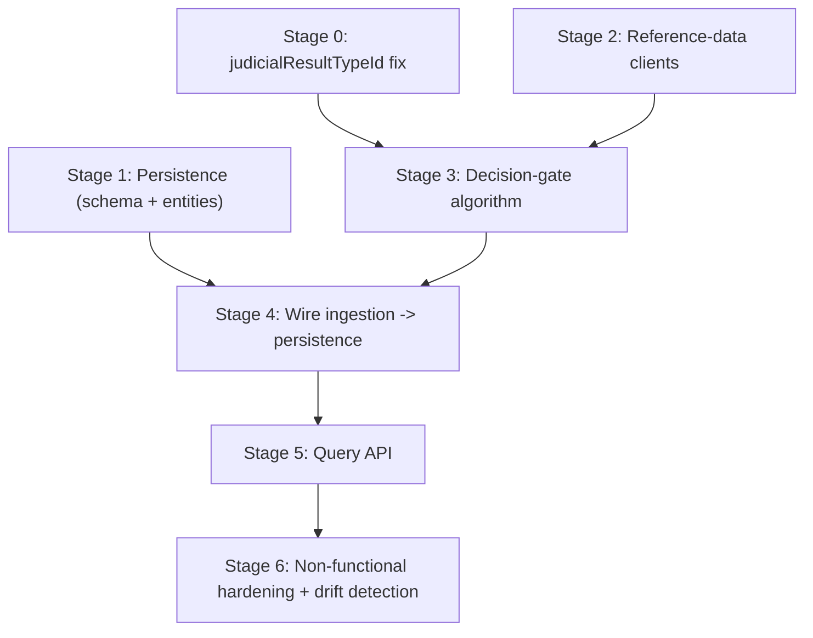

# service-cp-crime-results-nows — staged implementation plan

**Status:** In progress, 16 Sep 2026. Implements
[`2026-09-10-nows-generation-gate-technical-design.md`](./2026-09-10-nows-generation-gate-technical-design.md)
in 7 independently-shippable stages. Stages land as separate commits/PRs in the order below — each
stage builds and tests cleanly on its own before the next one starts.

## Context

The technical design doc fully specifies what to build: the generation-gate algorithm (§3), the
persistence schema (§5), and the Query API contract (§6). This repo currently has only the ingestion
skeleton — Service Bus consumer, Redis/REST hearing-detail resolution, and a stub decision engine
that always returns no eligible event types (§1's own status table). Everything else doesn't exist
yet. That's too much for one PR, so it's staged, in dependency order.

**Conventions this plan follows** (confirmed from this repo and its sibling
`service-cp-crime-results-pcr`, not invented): JUnit5 + Mockito
(`@ExtendWith(MockitoExtension.class)`, `@Mock`/`@InjectMocks`/`@Spy`) + AssertJ; test naming
`method_should_behavior_whenCondition`; WireMock standalone for outbound HTTP client tests;
integration tests boot the full Spring context against a **real Postgres on `localhost:5432`**
started via `docker compose up -d postgres` (not Testcontainers — see PCR's `PostgresInitialise`/
`RepositoryIntegrationTestBase`); package layout mirrors PCR's `entities/`, `repositories/`,
`controllers/`, `mappers/`.

## Stage 0 — Fix the `judicialResultTypeId` gap (§2)

Blocks Stage 3 — requirement-tree matching (§3c) and subscription include/exclude lists (§3d) both
key off this field, which this repo's model is missing.

- **Files:** `domain/HearingDetailsResponse.java` — add `judicialResultTypeId` to `JudicialResult`.
- **Tests:** deserialization test proving it round-trips onto the model.

## Stage 1 — Persistence: schema and entities (§5)

- **New `build.gradle` deps:** `spring-boot-starter-data-jpa`, `spring-boot-starter-flyway`,
  `flyway-core`, `flyway-database-postgresql`, `org.postgresql:postgresql` (copied from PCR).
- **Docker:** add a `postgres` service to `docker-compose.yml` (`postgres:18-alpine`,
  `POSTGRES_DB: nowsdb`, port `5432:5432`).
- **Migrations** (`V1.001`–`V1.005`): `now_hearing`, `now_defendant`, `now_defendant_case`,
  `now_defendant_snapshot` (`content JSONB`), `now_eligible_event`
  (`matched_result_type_ids JSONB`).
- **Entities + repositories:** one pair per table, in `entities/`/`repositories/`.
- **Tests:** repository integration tests (real Postgres) verifying Flyway applies cleanly, every
  unique constraint from §5a/§5b/§5c rejects duplicates, and the §4 upsert semantics work.

## Stage 2 — Reference-data clients (§3c/§3d)

Independent of Stage 1; built in parallel.

- **`NowsMetadataClient`** — `GET .../referencedata/nows-metadata?on=`, own domain
  (`NowMetadataResponse`/`NowDefinition`/`NowRequirement`/`NowTextEntry`), including
  `nowTextList`/`nowRequirementText`.
- **`NowsSubscriptionsClient`** — `GET .../referencedata/now-subscriptions?on=`, own domain
  (`NowsSubscription`/`NowsSubscriptionVocabulary`) — built fresh against the legacy
  `SubscriptionsService.js`, **not** copied/extended from PCR's `CPNowSubscription`/`CPVocabulary`.
- **Config:** extend `AppPropertiesBackend` with `referenceDataUrl`/`referenceDataCjscppuid`.
- **Tests:** WireMock unit tests per client (URL, headers, deserialization), synthetic fixtures
  under `src/test/resources/nows/`.

## Stage 3 — The decision-gate algorithm (§3a–§3e)

Depends on Stage 0 + Stage 2, not Stage 1 (pure computation). Sub-parts, each independently tested:
3a merge (`MergedDefendant`), 3b vocabulary (`NowsVocabulary`/`NowsVocabularyComputer` — own
implementation), 3c requirement-tree matching (`NowsMetadataMatcher` + `RegisteredNowEventTypes`
allow-list), 3d subscription matching (`NowsSubscriptionMatcher` — own implementation), 3e wiring
into `NowsDecisionEngine` (return type changes to carry `matched_result_type_ids` too). End-to-end
unit tests reproduce `analysis/e2eFlow/01-single-event-flow.md` and `02-multiple-events-flow.md`
exactly. Golden-master tests against real (anonymised) legacy hearings, per §9.

## Stage 4 — Wire ingestion to persistence (§4, §5b, §5c)

Depends on Stage 1 + Stage 3. New `NowDefendantSnapshotMapper` (builds §5b's `content` JSON).
`NowsIngestionService.processDefendant` replaces its `TODO` with real upserts across all five
tables. Unit tests (mapper shape, service repository calls) + integration tests (full
ingestion-to-Postgres, both worked scenarios, redelivery/idempotency).

## Stage 5 — Query API (§6)

Depends on Stage 4, and externally on the `api-cp-crime-results-nows` OpenAPI contract being
published (separate ticket) for the generated-interface pattern this codebase's reviews require.
`NowsQueryController` + `NowsQueryService` (resolve `caseURN`/`defendantId` → `masterDefendantId`,
filter `content` by `matched_result_type_ids`, `eventType`/`caseURN` query filters, §6d's
200-empty-array-vs-404 rule). Unit tests (service logic) + `@SpringBootTest`/`MockMvc` integration
tests against real Postgres, one per §6a/§6b JSON example.

## Stage 6 — Non-functional hardening

Depends on all prior stages. Redelivery/idempotency proven at the message-handling level (extends
existing `HearingResultedServiceBusConsumerTest` coverage), a PII-in-logs review pass, and a decision
on whether §9's golden-master suite grows into an ongoing maintained check (separate follow-up if so).

## Verification

`./gradlew test` for unit tests (JaCoCo already wired). `docker compose up -d postgres redis` before
any Stage 1/4/5 integration test run. Stage 3e's two `analysis/e2eFlow/` scenarios are the cheapest,
most direct regression check in this whole plan — they were hand-verified against the legacy
algorithm already.